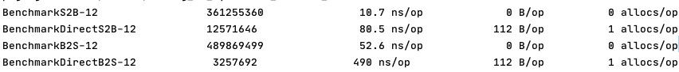
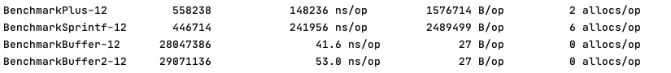

# Tricks On Go
Share some tricks on Go during my journey on Go. 🚀

## Convert strings 2 slice of Byte (or reverse) without memalloc

    see string_to_byteslice_without_memalloc

## Bench test 3 different ways to connect string

Buffer2 use`buffer.Write()` while Buffer use `buffer.WriteString()`, and in Buffer2, i use []byte(s) to convert string

## Bench test 3 different ways to convert integer to string

 

# Append In Slice

b := append(a[:i], a[i+1:]...) may cause the change slice a

# Function as Option

Function as Option makes API easier to understand.

# MAP SEARCH JUST INSANE!!!!

# MisUnderstanding of func `strings.Trim(a, b)`

the func will ensure that the output of the func must not contain any of the char in the string b.