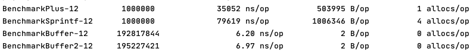

# Tricks On Go
Share some tricks on Go during my journey on Go. 🚀

## Convert strings 2 slice of Byte (or reverse) without memalloc

    see string_to_byteslice_without_memalloc

## Bench test 3 different ways to connect string

Buffer2 use`buffer.Write()` while Buffer use `buffer.WriteString()`, and in Buffer2, i use []byte(s) to convert string

## Bench test 3 different ways to convert integer to string

